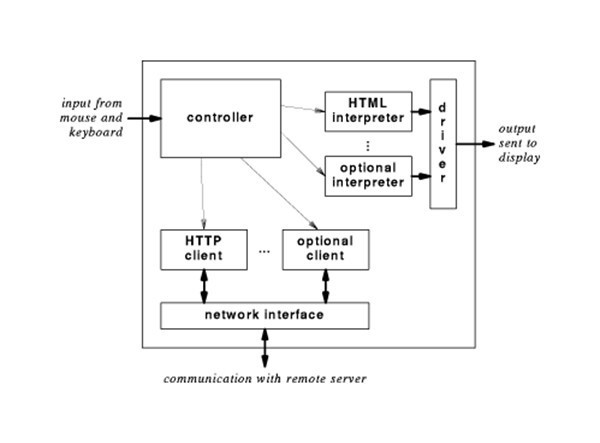
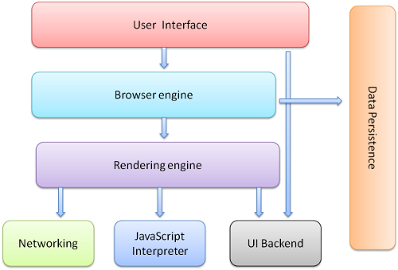
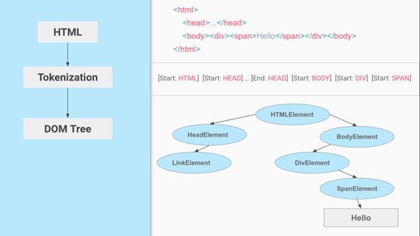
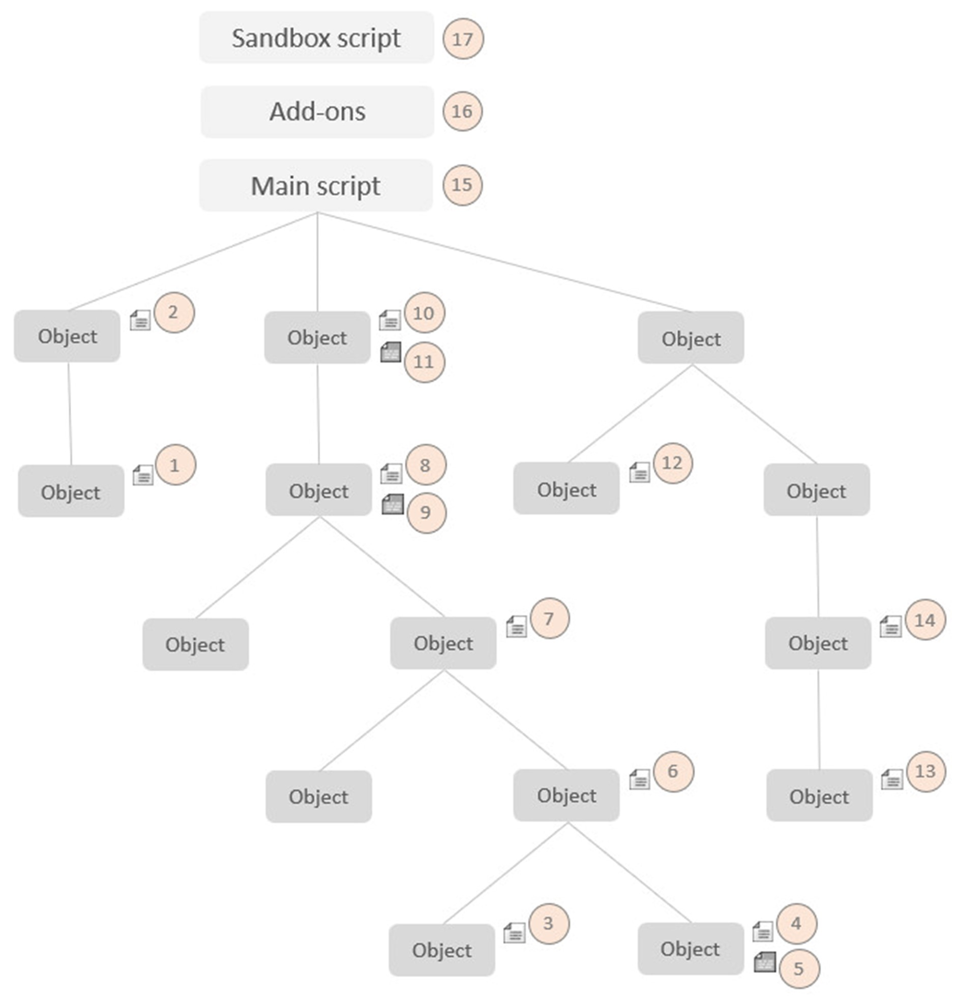
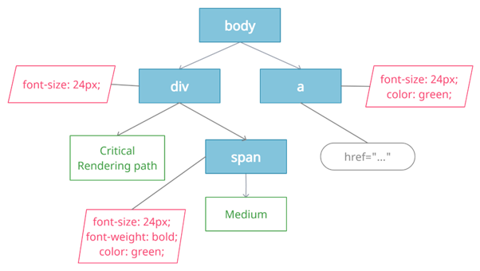
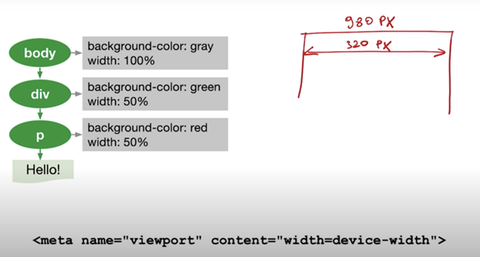

# When a user enters an URL in the browser, how does the browser fetch the desired result?

*  When you type any URL you basically want to
   reach the server where the   website is hosted.

* A web browser is a piece of software that loads files from a     remote   server (or perhaps a local disk) and displays them to you — allowing for user interaction.

* The browser engine is a core software component of every major browser, and different browser manufacturers call their engines by different names. The browser engine for Firefox is called Gecko, and Chrome’s is called Blink, which happens to be a fork of webKit.

* **The browser checks the cache for a DNS record to find the corresponding IP address of a website.**

* It looks for following cache. If not found in one, then continues checking to the next until found.  

  * Browser Cache
  * Operating System Cache
  * Router  Cache
  * ISP Cache

* The requests are sent using small data packets that contain information content of request and IP address it is destined for.

* Browser initiates a TCP (Transfer Control Protocol) connection with the server using synchronize(SYN) and acknowledge(ACK) messages.

* Browser sends an HTTP request to web server. GET or POST request.

*  Server on the host computer handles that request and sends back a response. It assembles a response in some format like JSON,XML and HTML.

* Server sends out an HTTP response along with the status of response.

* Browser displays HTML content and is done.

---
___

## What is the main functionality of the browser?

* The main function is to retrieve information from the World Wide Web and making it available for users.

* Visiting any website can be done using a web browser. When a URL is entered in a browser, the web server takes us to that website.

* To run Java applets and flash content, plugins are available on the web browser

* It makes Internet surfing easy as once we reach a website we can easily check the hyperlinks and get more and more useful data online.

* Browsers user internal cache which gets stored and the user can open the same webpage time and again without losing extra data.

* Multiple webpages can be opened at the same time on a web    browser.

* Options like back, forward, reload, stop reload, home, etc. are available on these web browsers, which make using them easy and convenient.

___

___

 ## High Level Components of a browser.

 ### The browser's main components are : 

1. The user interface:
This includes the address bar, back/forward button, bookmarking menu, etc. Every part of the browser display except the window where you see the requested page.

2. The browser engine: marshals actions between the UI and the rendering engine.

3. The rendering engine :
responsible for displaying requested content. For example if the requested content is HTML, the rendering engine parses HTML and CSS, and displays the parsed content on the screen.

4. Networking:
For network calls such as HTTP requests, using different implementations for different platform behind a platform-independent interface.

5. UI backend:
Used for drawing basic widgets like combo boxes and windows. This backend exposes a generic interface that is not platform specific. Underneath it uses operating system user interface methods.

6. JavaScript interpreter.
Used to parse and execute JavaScript code.

7. Data storage.

8. This is a persistence layer. The browser may need to save all sorts of data locally, such as cookies. Browsers also support storage mechanisms such as localStorage, IndexedDB, WebSQL and FileSystem.

___
___

 ## Rendering Engines and it’s uses

As the name suggests, this component is responsible for rendering a specific web page requested by the user on their screen. It interprets HTML and XML documents along with images that are styled or formatted using CSS, and a final layout is generated, which is displayed on the user interface.

Note: Every browser has its own unique rendering engine. Rendering engines might also differ for different browser versions. The list below mentions browser engines used by a few common browsers:

1. Google Chrome and Opera v.15+: Blink
2. Internet Explorer: Trident
3. Mozilla Firefox: Gecko
4. Chrome for iOS and Safari: WebKit

___
___

## Role of Rendering Engine

Once a user requests a particular document, the rendering engine starts fetching the content of the requested document. This is done via the networking layer. The rendering engine starts receiving the content of that specific document in chunks of 8 KBs from the networking layer. After this, the basic flow of the rendering engine begins.

*	The requested HTML page is parsed in chunks, including the external CSS files and in style elements, by the rendering engine. The HTML elements are then converted into DOM nodes to form a “content tree” or “DOM tree.”

*	Simultaneously, the browser also creates a render tree. This tree includes both the styling information as well as the visual instructions that define the order in which the elements will be displayed. The render tree ensures that the content is displayed in the desired order.

*	Further, the render tree goes through the layout process. When a render tree is created, the position or size values are not assigned. The entire process of calculating values for evaluating the desired position is called a layout process. In this process, every node is assigned the exact coordinates. This ensures that every node appears at an accurate position on the screen.

*	The final step is to paint the screen, wherein the render tree is traversed, and the renderer’s paint() method is invoked, which paints each node on the screen using the UI backend layer.

___
___

##       Parsers (HTML,CSS,etc)

So we have HTML content at the beginning which goes through a process called tokenization, tokenization is a common process in almost every programming language where code is split into several tokens which are easier to understand while parsing. This is where the HTML's parser understands which is the start and which is the end of the tag, which tag it is and what is inside the tag.

Now we know, html tag starts at the top and then the head tag starts before the html ends so we can figure out that the head is inside html and create a tree out of it. Thus we then get something called a parse tree which eventually becomes a DOM tree as shown in the image below:

DOM tree is what we access when we do document.getElementById or document.querySelector in JavaScript.

Just like HTML, CSS goes through a similar process where we have the CSS text and then the tokenization of CSS to eventually create something called a CSSOM or CSS Object Model.

This is what a CSS Object Model looks like:

___
___

## Script Processors

The script processor executes Javascript code to process an event. The processor uses a pure Go implementation of ECMAScript 5.1 and has no external dependencies. This can be useful in situations where one of the other processors doesn’t provide the functionality you need to filter events.

The processor can be configured by embedding Javascript in your configuration file or by pointing the processor at external file(s).

Parameters can be passed to the script by adding params to the config. This allows for a script to be made reusable. When using params the code must define a register(params) function to receive the parameters.

___
___

## Order of Script Processing

Script callback functions are not executed in a random order: script location and type have an influence on when (in relation to others) a script is executed or called:

Execution precedence is first and foremost based on location: a child object's script has always higher priority than its parent's script, and thus will be called before. In case of two sibling objects, precedence is given by the order they appear in the scene hierarchy, unless they have a different priority flag, in which case that flag decides the precedence.

Execution precedence is next decided by the script type, from first to last executed: child script, customization , add-on script , and finally the sandbox script.

A simple rule to remember is: the more important or persistent a script is, the later it will be called. There are exceptions to this, depending on the callback type: e.g. the conatct - and the  dynamic callback are executed in reverse order. Additionally, when the caller expects a return value, the call chain is interrupted as soon as the first return value is received.

___
___

## Tree Construction

The render tree is the combination of DOM and CSSOM. In order to create Render Tree, the browser starts traversing the DOM and looks for the matching styles in CSSOM, then these two are combined to create a render tree node that contains both content and styles information.

Render Tree contains only nodes that will be visible on the screen, for example, nodes of the tags like meta, script, link, etc, or nodes that are hidden using CSS styles (like display: none), are not included.

___
___

 ## Layout and Painting

 The layout (also called reflow) peace will be in charge to calculate the positions and dimensions of each node on the screen. For instance, if you rotate your phone, or if you resize your browser, the layout peace will be executed. let’s take a look another example related to layout:

 

In the left side, we have our Render Tree (with Green nodes), and at the bottom, we have the meta tag needed to indicate to the browser that that 100% means the pixels of the device, in this example 320px. If we don’t define that meta tag, the browser will define by default 980px that will cause the unwanted zoom in the browser from mobile devices.

# The layout will be in charge to calculate the Box Model like it shows the Chrome dev tool.

## Paint

Finally, now that we know which nodes are visible, and their computed styles and geometry, we can pass this information to the final stage, which converts each node in the render tree to actual pixels on the screen. This step is often referred to as “painting”, “rasterizing.” or “repainting”.

